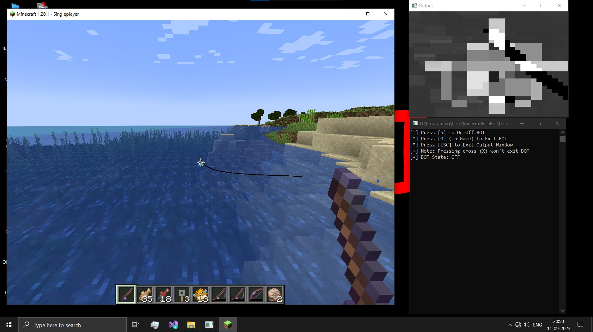
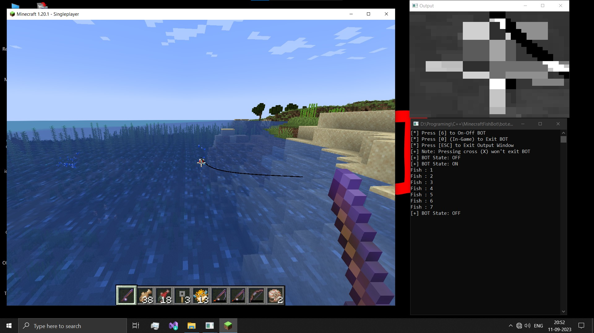
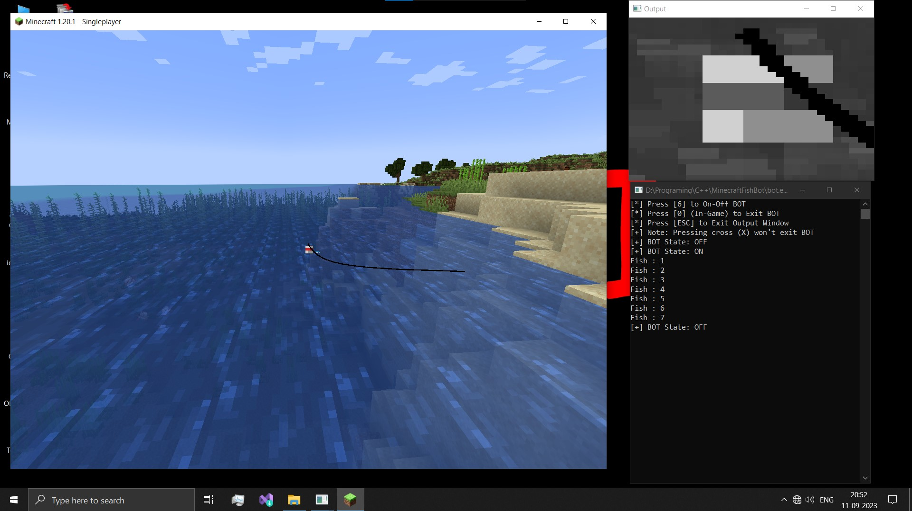

# MinecraftFishBot
For windows (x64) !!

Minecraft 1.16+ (JAVA edition) got a nerf in terms of fishing mechanics . because of that, simple fish farms now don't get you Loots . To resolve that I've come across a article in Medium by 'Rob Dundas' that describes how you can implement opencv to automate the fishing process with the help of a python script . based on that I've created this BOT (with C++) that'll do fishing for you so that you can take a nap .

# Instruction (how to use)
* Just download the provided **.zip** from release section __(only x64 build is provided . so , sorry to 32bit machine users )__
* Extract it anywhere you want
* Double click on the **bot.exe** and you'll be invited with 2 windows
> [Terminal] : will show some info releted to bot program .    

> [Output] : will show 30x30 area around your mouse to help you place your bobber in center of it.
* Open MC (must not be full window [see below screenshots]) and place the bobber in center of the cursor ('+' in game) in a way that whenever you right click (to cast the rod) the bobber goes back to same position ('+') . might need some adjustment of FOV (btwn 70-100) .
* After you make sure everything is perfect (fishing rod must not be casted at this point) then toggle the BOT using key '6' (or whatever terminal says) .

## Note
While BOT is doing it's work don't touch your mouse (if you did, something unexpected might happen but you can always press '0' to shutdown the BOT )

# ScreenShots

## Credits
> Rob Dundas    

> Casual Coder